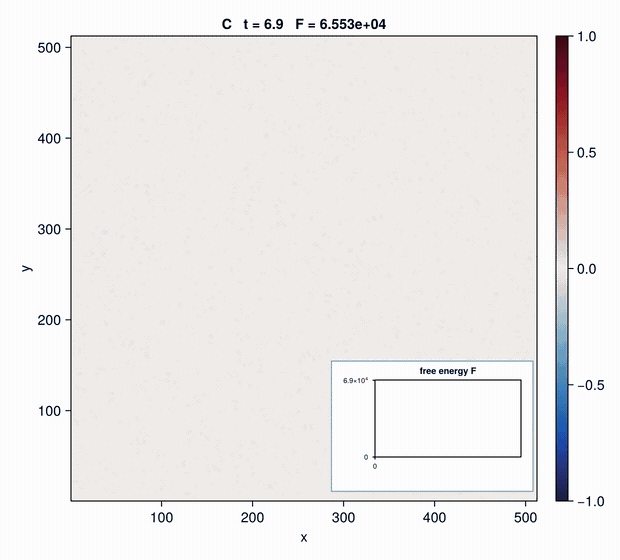
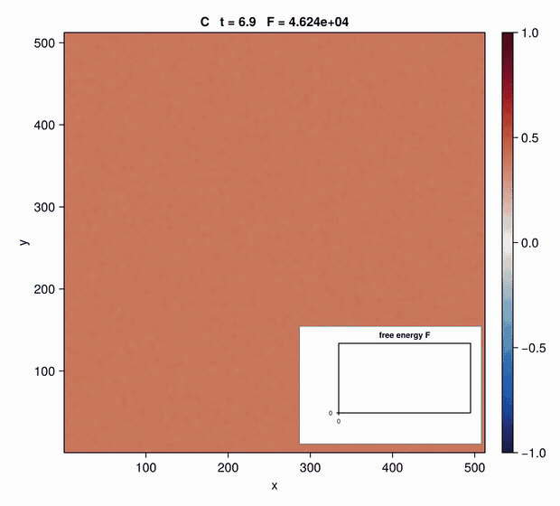
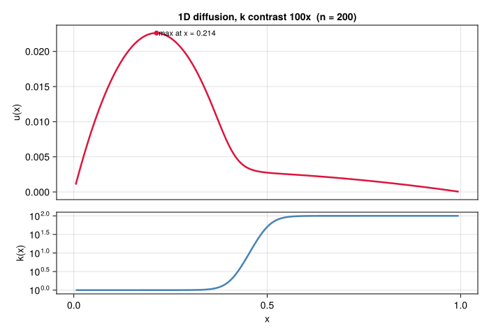

# JuliaCon26-GPUs-for-HPC

Hands-on with Julia for HPC on GPUs workshop at [JuliaCon 2026](https://juliacon.org/2026/).


<br>

**Instructors:** [Ludovic Räss](https://github.com/luraess), [Ivan Utkin](https://github.com/utkinis), [Collin Wittenstein](https://github.com/cwittens) and [Boris Kaus](https://github.com/boriskaus)

**Where:** JGU Mainz, Muschel — N2

**When:** August 10th, 14:30–17:30 (CEST)

**More:** [https://pretalx.com/juliacon-2026/talk/MRFYNN/ (pretalx)](https://pretalx.com/juliacon-2026/talk/MRFYNN/)

## About

Julia offers the best of both worlds: high-level expressiveness with low-level performance, so modern accelerators can be targeted without writing hardware-specific code.

This workshop makes that concrete for PDE solvers. We take one equation, Cahn-Hilliard in 2D, and carry it from a plain Julia loop to a GPU kernel running close to the memory bandwidth of the device, measuring at every step. Along the way: [KernelAbstractions.jl](https://github.com/JuliaGPU/KernelAbstractions.jl) for portable kernels, [Chmy.jl (v0.2)](https://github.com/PTsolvers/Chmy.jl/tree/iu/v0.2) for finite-difference discretisations, [PETSc.jl](https://github.com/JuliaParallel/PETSc.jl) for implicit and CPU-parallel solves, and [Reactant.jl](https://github.com/EnzymeAD/Reactant.jl) if time allows.

### Scope

The workshop concentrates on **single-device performance and portability**. Everything measured here, from the memcopy ceiling to the flat cost-per-cell across a 1024× range in problem size, is about using one GPU well and knowing when it is being used well.

Multi-device parallelisation is the natural next step rather than a separate subject. [ParallelStencil.jl](https://github.com/omlins/ParallelStencil.jl) and [ImplicitGlobalGrid.jl](https://github.com/omlins/ImplicitGlobalGrid.jl) cover it, hiding the halo exchange behind the same stencil syntax so that a single-GPU code becomes a multi-GPU one with little change. They are left out here for time, but the weak scaling shown in Part 1 is exactly the property that carries over: a domain too large for one device is split across several at constant cost per cell. For this solver a single 144 GB GH200 holds roughly 65536² before that becomes necessary.

## Getting started

> **TODO** — access to the Otus cluster at PC2: account request, login, module setup, how to grab an H100 node, and the Julia environment to instantiate.

All scripts referenced below live in [`scripts/`](scripts/).

## Workshop outline

1. [**Part 1: Performance basics**](#part-1-performance-basics) — what limits a stencil code, and how to measure it
2. [**Part 2: KernelAbstractions**](#part-2-kernelabstractions) — portable kernels, and composing with the wider ecosystem (e.g. a different timestepper instead of explicit Euler)
3. [**Part 3: Using Chmy.jl**](#part-3-using-chmyjl) — the same equations, expressed at a higher level using dimensions-agnostic DSL
4. [**Part 4: Using PETSc.jl**](#part-4-using-petscjl) — the same equations again, via [PETSc](https://petsc.org/) but on (parallel) CPUs
5. [**Part 5: Using Reactant.jl**](#part-5-using-reactantjl) — if time permits

# Part 1: Performance basics

## Why bother with GPUs

PDEs get expensive fast. Cahn-Hilliard is fourth order, so an explicit timestep is bounded by `dt ∝ dx⁴`: refining the mesh by 2 costs 16× more steps *and* 4× more cells. Useful resolutions are large — at **8192²** a domain holds ~650 features, enough for coarsening statistics not dominated by the box size.

That run is 40 000 steps over 67 M cells:

| | per cell | 8192², 40 000 steps |
|---|---|---|
| Apple M2 laptop, 8 threads | 0.72 ns | ~32 min |
| Grace CPU, 36 of 72 cores | 0.125 ns | 5.6 min |
| GH200 144G HBM3e | 0.012 ns | **31 s** |

The Grace row sits on the *same node* as the GPU, so it is the like-for-like comparison: **10.8× slower**, with the same code, the same `Float64` and the same `Δmean = 1e-20`. The difference is memory bandwidth rather than arithmetic speed, quantified below.

## The model

The [Cahn–Hilliard equation](https://en.wikipedia.org/wiki/Cahn%E2%80%93Hilliard_equation), phase separation of a binary mixture:

```
∂C/∂t = D ∇²μ ,    μ = C³ - C - γ ∇²C
```

with no-flux boundaries on both `C` and `μ`, imposed by a ghost-node mirror (`A[0] -> A[1]`), which makes the scheme exactly mass-conserving.

**The conserved mean `C̄` selects the regime.** It is fixed by the initial condition and never moves, so it acts as a model parameter:

| `C̄ = 0` — bicontinuous | `C̄ = 0.4` — droplets |
|---|---|
|  |  |

Uniform states are unstable only for `|C̄| < 1/√3 ≈ 0.577`; beyond that the mixture is metastable and separation requires nucleation. Growth also slows as `|C̄|` rises, the rate going as `(1-3C̄²)²`, so `C̄ = 0.4` takes ~3.7× longer to separate than `C̄ = 0`.

**Two invariants worth asserting on.** Both are cheap, and together they catch sign errors, wrong boundary conditions and unstable timesteps:

- free energy `F = ∫[(C²-1)²/4 + γ/2|∇C|²]` decreases monotonically
- `mean(C)` is constant — machine zero in Float64, ~1e-11 in Float32

## A first implementation

[`CahnHilliard2D_plain.jl`](scripts/CahnHilliard2D_plain.jl) is the solver in plain Julia — explicit loops, no abstractions, ~95 lines including plotting. The physics is two passes over the grid:

```julia
# no-flux (∂n = 0) through the ghost-node mirror A[0]->A[1], A[n+1]->A[n]
Base.@propagate_inbounds function lap(A, ix, iy, nx, ny)
    a = A[ix, iy]
    return (A[min(ix+1, nx), iy] - 2a + A[max(ix-1, 1), iy]) +
           (A[ix, min(iy+1, ny)] - 2a + A[ix, max(iy-1, 1)])
end

# pass 1: chemical potential μ = C³ - C - γ∇²C
function chemical_potential!(μ, C, γ)
    nx, ny = size(C)
    @inbounds for iy in 1:ny, ix in 1:nx
        c = C[ix, iy]
        μ[ix, iy] = c * c * c - c - γ * lap(C, ix, iy, nx, ny)
    end
end

# pass 2: concentration update C += dt·D·∇²μ
function update_concentration!(C, μ, dtD)
    nx, ny = size(C)
    @inbounds for iy in 1:ny, ix in 1:nx
        C[ix, iy] += dtD * lap(μ, ix, iy, nx, ny)
    end
end
```

The `min`/`max` in `lap` apply the ghost-node mirror without branching. Only two arrays are ever written: `μ` has to be a real array because pass 2 reads its *neighbours*, while `∇²C`, the fluxes `qCx`, `qCy` and the other intermediates collapse into registers, since

```
∂C/∂t = D ∇²μ = -D ∇·q        with     q = -∇μ
```

i.e. the flux divergence *is* the Laplacian of `μ`.

This runs fine at 512². Reaching 8192² takes two further things: scaling that keeps the constants well-conditioned, and hardware that can move the memory. Both are the subject of the rest of Part 1.

## Scaling

**Grid units (`dx = dy = 1`).** The common alternative is to fix a unit box, `lx = ly = 1`. At `nx = 128` that gives `γ ≈ 1.1e-4`, `dt ≈ 4.6e-7` and `1/dx² ≈ 1.6e4`: eleven orders of magnitude between the smallest and largest constant, and all of them move when `nx` changes. In grid units the same three are `γ = 2`, `dt = 7e-3`, `D = 1`, all O(1) and independent of `nx`. That is also what makes a Float32-only backend safe. Physical units for a cell size `L` follow from `γ_phys = γ·L²`, `t_phys = t·L²/D`, `w_phys = w·L`.

A useful consequence: the interface width `w = √(8γ)` and the fastest-growing wavelength `Λ = 2π√(2γ)` are both measured *in cells* and independent of `n`. Growing `n` therefore enlarges the domain at fixed resolution-per-feature, and **`dt` does not shrink**. That is weak scaling, and it is what makes 8192² affordable. Resolving the interface better instead means raising `wcell`, at a cost of `nt ∝ wcell⁴`.

## Memory bound, and what to measure

A 5-point Laplacian does a handful of flops per cell and moves several arrays. Current hardware manages ~50 flops in the time it takes to fetch one number from main memory, so the bytes transfer dominate and arithmetic intensity or FLOP/s is not a useful metric.

Wall time is what ultimately matters and it is the right number to report for a production run. What it does not reveal is how well the hardware is being used, or whether a different implementation would do better: a poor kernel on a fast machine and a good one on a slow machine can take the same time. That needs a second number, measuring the implementation against what the hardware can deliver.

The two measurements above make the point. Grace sustains 321 GB/s on this problem and the GH200 3460 GB/s, a ratio of **10.8**; the wall-time ratio was also **10.8×**. To two digits the speedup is the bandwidth ratio.

The CPU thread sweep shows the same from the other side, for Cahn-Hilliard at 8192² on Grace:

| threads | `T_eff` | speedup | parallel efficiency |
|---|---|---|---|
| 1 | 16.8 GB/s | 1.0× | 100% |
| 4 | 65.6 | 3.9× | 98% |
| 8 | 130.3 | 7.7× | 97% |
| 18 | 252.3 | 15.0× | 83% |
| 36 | **320.7** | 19.1× | 53% |
| 72 | 287.0 | 17.1× | 24% |

Near-linear to 8 threads, rolling off after, saturating at 36, and slower on 72 cores than on 36. The memory bus saturates before the cores do.

Hence counting the arrays each kernel must move, ignoring cache:

```
memcopy    A = B              -> 2 arrays (1 read  + 1 write)
saxpy      A = B + s*C        -> 3 arrays (2 reads + 1 write)
diffusion  C2 = C + dt·D·∇²C  -> 2 arrays (1 read  + 1 write)
Cahn-Hilliard, per step       -> 5 arrays (read C, write μ | read μ, read C, write C)

T_eff = n_arrays · nx·ny·sizeof(eltype) / t_it
```

`T_eff` assumes *perfect* caching of stencil halos, so it charges only the minimum traffic. A kernel reaching the memcopy rate is doing about as well as the hardware allows.

## Step 1 — measure the ceiling

[`memcopy2D_KA.jl`](scripts/memcopy2D_KA.jl) runs memcopy, saxpy and diffusion (Laplacian) across resolutions:

```julia
julia> include("scripts/memcopy2D_KA.jl")   # memcopy_bench()
```

GH200 144G HBM3e, Float64. Device-reported peak is **4917 GB/s** (3.201 GHz × 6144 bit); `copyto!` — NVIDIA's own tuned copy — reaches **4308 GB/s**, i.e. 88% of it.

| n | memcopy [2] | saxpy [3] | diffusion [2] |
|---|---|---|---|
| 512 | 1294 | 1729 | 1249 |
| 1024 | 3480 | 5055 | 2589 |
| 2048 | 3242 | 3822 | 2805 |
| 4096 | 3791 | 4251 | 3206 |
| 8192 | 3947 | 4414 | 3334 |
| 16384 | 3984 | 4433 | 3346 |
| 32768 | **3988** | **4457** | **3269** |

All four below at 16384², so they are directly comparable:

| | `T_eff` | of peak | of `copyto!` | of memcopy |
|---|---|---|---|---|
| `copyto!` (vendor, 1:1) | 4308 | 88% | 100% | 108% |
| saxpy (KA, 2:1) | 4433 | 90% | 103% | 111% |
| memcopy (KA, 1:1) | 3984 | 81% | 92% | 100% |
| diffusion (KA) | 3346 | 68% | 78% | 84% |

Percentages below are against **KA memcopy** unless stated otherwise: it is written with the same tools as the solver, so it is the like-for-like reference. The other columns answer different questions — `copyto!` for what the abstraction costs (8%), peak for what the silicon could do in principle.

Only the bottom of the size sweep measures bandwidth. 512² is launch-bound at a third of the rate; 1024² saxpy reports 5055 GB/s, above hardware peak, because the working set is L2-resident; 2048² sits in the L2-boundary dip. From 8192² up the numbers are flat to 1%.

A 2:1 read:write ratio also beats any 1:1 copy: saxpy is 11% above memcopy and 3% above the vendor copy, since it costs fewer DRAM bus turnarounds per byte. This is the same effect that puts STREAM Triad above STREAM Copy on most GPUs, and a reminder that the achievable rate depends on the access pattern as well as the hardware.

Diffusion, one Laplacian on top of a copy, holds **82–85% of memcopy** at every converged size. The added flops are essentially free; the cost is the stencil's halo traffic.

## Step 2 — Cahn-Hilliard

```julia
julia> include("scripts/CahnHilliard2D_KA.jl")   # or scaling_test()
```

| n | `T_eff` | of saxpy | of memcopy | ns/cell |
|---|---|---|---|---|
| 512 | 1249 | 28% | 31% | 0.032 |
| 1024 | 3242 | 73% | 81% | 0.012 |
| 2048 | 3230 | 72% | 81% | 0.012 |
| 4096 | 3546 | 80% | 89% | 0.011 |
| 8192 | 3460 | 78% | 87% | 0.012 |
| 16384 | 3406 | 76% | 85% | 0.012 |
| 32768 | 3376 | 76% | 85% | 0.012 |

Two Laplacians and two passes, at **~85% of memcopy**. With the ceiling measured, that number says how much room is left — here, not much.

The last column is worth a look as well. From 1024² up the cost per cell is flat at ~0.012 ns across a **1024× range in problem size**, 16 MB to 16 GB of arrays. This is the weak scaling from earlier: a bigger run is a bigger domain at constant cost per cell, not a longer one. `Δmean` stays at ~1e-20 throughout. Only 512² falls off, being too little work to fill the device. Repeat runs agree to within 1.8% at every size.

The remaining ~15% is not waste, and `ncu` shows why. At 8192² the stencil moves *exactly* the DRAM traffic memcopy does, 536.9 MB read and 517 MB written. The halo re-reads never reach memory: a neighbour was already fetched for the adjacent thread and is served from L2. So the 2-array charge in `T_eff` is not an approximation here, it is what the hardware actually does.

What differs is the number of load *requests*. Each stencil thread issues five loads where memcopy issues one, and `ncu` counts 5.25× the L1 load sectors (88.1 M against 16.8 M). Those extra loads are nearly free in bytes but each still occupies the load/store unit for a cycle, so the LSU pipeline saturates before the memory bus does.

The stencil is therefore request-bound rather than bandwidth-bound. Cache blocking targets DRAM traffic, which is already at its minimum, so it would change nothing. Reducing the request *count* is what would help: having each thread compute several output points reuses loaded values in registers and cuts loads per output. That is untested here, and it trades against register pressure.

## Same code, two machines

The identical scripts on the Grace CPU of the same node (36 threads, 8192², Float64):

| | Grace, 36 cores | GH200 | ratio |
|---|---|---|---|
| memcopy [2] | 398 GB/s | 3947 | 9.9× |
| saxpy [3] | 391 | 4414 | 11.3× |
| diffusion [2] | 371 | 3334 | 9.0× |
| **Cahn-Hilliard [5]** | **321** | **3460** | **10.8×** |
| | | | |
| Cahn-Hilliard, % of own memcopy | 81% | 88% | |

The solver sits at a similar fraction of its machine's copy rate on both — 81% on Grace, 88% on Hopper. What changed between them is the ceiling, not the quality of the code, which is the practical use of `T_eff`: it reports how much room is left on a single machine, without needing a second one for comparison.

One asymmetry: on the GPU saxpy is 12% above memcopy, on Grace 2% below it. The bus-turnaround advantage of a 2:1 read:write ratio is a GPU effect that a CPU's caches and prefetchers largely hide, so saxpy is the better reference on GPUs, memcopy on Grace.

## The route there

Part 1 writes the same equation three times, each a small step from the last:

1. [`CahnHilliard2D_plain.jl`](scripts/CahnHilliard2D_plain.jl), explicit loops on the CPU. The reference implementation, and the one to read first.
2. [`CahnHilliard2D_KA.jl`](scripts/CahnHilliard2D_KA.jl), the same two passes as KernelAbstractions kernels. Runs on CPU threads or on a GPU by uncommenting one line.
3. [`memcopy2D_KA.jl`](scripts/memcopy2D_KA.jl), the ceiling the other two are measured against.

The first two try to stay line-for-line comparable: same `lap`, same two passes, same diagnostics. Diffing them shows what moving to a GPU costs in source terms.

| script | |
|---|---|
| [`memcopy2D_KA.jl`](scripts/memcopy2D_KA.jl) | memcopy / saxpy / diffusion, `T_eff` reference |
| [`CahnHilliard2D_plain.jl`](scripts/CahnHilliard2D_plain.jl) | plain Julia, explicit loops, CPU |
| [`CahnHilliard2D_KA.jl`](scripts/CahnHilliard2D_KA.jl) | KernelAbstractions twin, CPU / CUDA |
| [`CahnHilliard2D_KA_metal.jl`](scripts/CahnHilliard2D_KA_metal.jl), [`memcopy2D_KA_metal.jl`](scripts/memcopy2D_KA_metal.jl) | Apple GPU variants, see below |
| [`common.jl`](scripts/common.jl) | shared helpers: `outdir`, `T_eff`, `bench`, figures |

## Benchmarking traps

The streaming kernels reproduce to ±0.1%. The stencil is more sensitive, landing anywhere in 2620–3130 GB/s on the same hardware depending on how it is measured:

- **`zeros` is not representative data.** All-zero data toggles far fewer HBM lines; on a power-capped GH200 the SM clock sat at ~1720 MHz on zeros versus ~1355 MHz on real data, worth ~5% to the stencil. Fill with `rand!`.
- **Burst ≠ sustained.** A 50-launch burst runs ~11% faster than a multi-second loop.
- **Small `n` is not a bandwidth measurement.** ≤1024² is L2-resident and can report above hardware peak, ≤512² is launch-bound, 2048² sits in the L2-boundary dip. 4096² is still 5% low.
- **`@inbounds` does not cross a function call.** `@kernel inbounds = true` covers only the kernel body, so `lap` needs `Base.@propagate_inbounds`. Worth 9%, and invisible in every memory metric; the only tell is registers/thread.

Tried on CUDA without benefit: workgroup shape, `@Const`, hoisting loads, interior-only guards. Numbers in `CLAUDE.md`.

## Running on an Apple laptop

Metal is not in the project by default, so start with `] add Metal`. The backend is Float32-only, which the grid units already accommodate. The `*_metal.jl` variants are preferable to switching the backend line in the NVIDIA scripts: on Apple GPUs KA rebuilds `(ix,iy)` from a 1D dispatch in 64-bit arithmetic, emulated in software, costing ~5× on any 2D kernel ([Metal.jl#910](https://github.com/JuliaGPU/Metal.jl/issues/910)). The `_metal` scripts carry an `Int32` shift/mask workaround that recovers it.

`scaling_test(; fast=false)` versus `fast=true` on the same machine:

| n | `fast=true` | `fast=false` |
|---|---|---|
| 512 | 44.3 GB/s | 22.6 |
| 1024 | 65.7 | 24.1 |
| 2048 | 69.9 | 23.0 |

The slow path is flat at ~0.87 ns/cell at every resolution, being bound by per-thread index arithmetic rather than by grid size. On NVIDIA the same 2D penalty exists but is mild, and largely removed by the static workgroup size and static `ndrange` these scripts already use.

# Part 2: KernelAbstractions

by Collin Wittenstein: [cwittens.github.io](https://cwittens.github.io/)

If you want an interative Jupyter Notebook of this Part, you can find it [here](https://github.com/PTsolvers/JuliaCon26-GPUs-for-HPC/blob/main/scripts/Part2_KA_notebook.ipynb).

We build the Cahn-Hilliard solver from Part 1 again, this time with KernelAbstractions:

1. Write the kernels.
2. Look at how a kernel gets launched, and what a sloppy launch costs.
3. Build ∂C/∂t out of them, in two versions, and benchmark both.
4. Hand it to OrdinaryDiffEq and run the simulation.
5. Time the whole solve and compare with step 3.

The equation is still the same as in Part 1:

```
∂C/∂t = D ∇²μ ,    μ = C³ - C - γ ∇²C
```

No-flux boundaries, grid units (`dx = dy = 1`).

## Setup

````julia
using KernelAbstractions
using CUDA
using Adapt: adapt
using OrdinaryDiffEqStabilizedRK
using BenchmarkTools, Random, Statistics, Printf
using CairoMakie

backend = CUDABackend()
# backend = ROCBackend()      # AMD
# backend = MetalBackend()    # Apple, Float32 only
# backend = CPU()             # no GPU needed, also good for debugging

T = Float64;
````

One only has to change the `backend` line to switch vendors. The rest of the code is completely portable!

Benchmark helper function to time the kernel and compare against the expected
memory traffic. This is Part 1's `T_eff`: the arrays a kernel has to move,
divided by the time it took, so a rate in GB/s that can be held against what
the hardware can deliver.

````julia
function bench(f, backend, bytes; reps = 10)
    f(); KernelAbstractions.synchronize(backend)   # compile + warm up
    t = @belapsed begin
        for _ in 1:$reps
            $f()
        end
        KernelAbstractions.synchronize($backend)
    end
    return bytes * reps / t / 1e9   # GB/s
end;
````

## 1. Kernel syntax

The plain-Julia first pass from Part 1, computing the chemical potential:

```julia
function chemical_potential!(μ, C, γ)
    nx, ny = size(C)
    @inbounds for iy in 1:ny, ix in 1:nx
        c = C[ix, iy]
        μ[ix, iy] = c * c * c - c - γ * lap(C, ix, iy, nx, ny)
    end
end
```

Same physics as a KA kernel. The Laplacian is written out inline here instead
of through a `lap` helper, and the grid spacing is carried in `ax`, `ay`. (ax = 1/dx²)
Getting rid of `lap` here is just personal taste.

````julia
@kernel inbounds = true function kernel_potential!(Dst, @Const(C), Nx, Ny, ax, ay, γ)
    i, j = @index(Global, NTuple)

    # no-flux (∂n = 0) via ghost-node mirror
    idx_left  = max(i - 1, 1)
    idx_right = min(i + 1, Nx)
    jdx_down  = max(j - 1, 1)
    jdx_up    = min(j + 1, Ny)

    # μ = C³ - C - γ ∇²C
    Dst[i, j] = C[i, j] * (C[i, j]^2 - 1) - γ * (
        (C[idx_left, j] - 2 * C[i, j] + C[idx_right, j]) * ax +
        (C[i, jdx_down] - 2 * C[i, j] + C[i, jdx_up]) * ay
    )
end
````

````
kernel_potential! (generic function with 4 methods)
````

The arithmetic is unchanged. The loop is gone: a kernel describes what one
work item does (the inner part of the loop basically), and `@index(Global, NTuple)` supplies
the `(i, j)` the loop used to provide.

The four annotations:

- `@kernel`: marks the function as a kernel. Returns nothing, writes into its
  arguments.
- `@index(Global, NTuple)`: index tuple for this work item. Use
  `@index(Global, Linear)` for a single integer on 1D arrays.
- `@Const(C)`: promises nothing writes to `C`. Information the compiler can use to optimize.
- `inbounds = true`: applies `@inbounds` to the whole kernel body. It stops at
  function calls, so any helper the kernel calls needs
  `Base.@propagate_inbounds`.

More kernels:

````julia
@kernel inbounds = true function kernel_concentration!(Dst, @Const(μ), Nx, Ny, ax, ay, D)
    i, j = @index(Global, NTuple)

    idx_left  = max(i - 1, 1)
    idx_right = min(i + 1, Nx)
    jdx_down  = max(j - 1, 1)
    jdx_up    = min(j + 1, Ny)

    # ∂C/∂t = D ∇²μ
    Dst[i, j] = D * (
        (μ[idx_left, j] - 2 * μ[i, j] + μ[idx_right, j]) * ax +
        (μ[i, jdx_down] - 2 * μ[i, j] + μ[i, jdx_up]) * ay
    )
end
````

````
kernel_concentration! (generic function with 4 methods)
````

Generic Laplacian, needed below:

````julia
@kernel inbounds = true function kernel_diffusion!(Dst, @Const(u), Nx, Ny, ax, ay)
    i, j = @index(Global, NTuple)

    idx_left  = max(i - 1, 1)
    idx_right = min(i + 1, Nx)
    jdx_down  = max(j - 1, 1)
    jdx_up    = min(j + 1, Ny)

    Dst[i, j] = (u[idx_left, j] - 2 * u[i, j] + u[idx_right, j]) * ax +
                (u[i, jdx_down] - 2 * u[i, j] + u[i, jdx_up]) * ay
end
````

````
kernel_diffusion! (generic function with 4 methods)
````

Now that we have written the kernels, we want to launch them. This is a little bit different than a normal function call and it takes two steps. First, we instantiate the kernel for a backend, then we call it with an `ndrange`:

```julia
diffusion = kernel_diffusion!(backend)
diffusion(dst, src, Nx, Ny, ax, ay, ndrange = size(src))
```

Mind that we not only pass the arguments to the kernel, but also the `ndrange` argument.

If you want a more detailed introduction into KernelAbstractions.jl, you can check out this tutorial I wrote a few months ago:
[github.com/cwittens/A_KernelAbstractions_Tutorial](https://github.com/cwittens/A_KernelAbstractions_Tutorial/)

## 2. Launch configuration

What we just did, instantiating as `diffusion = kernel_diffusion!(backend)` leaves the workgroup size and the `ndrange` unknown until call time, which means the compiler can not optimise for it. Either or both can be fixed at specialisation:

```julia
k = kernel_diffusion!(backend)                    # both dynamic
k = kernel_diffusion!(backend, (128, 2))          # static workgroup size
k = kernel_diffusion!(backend, (128, 2), ndr)     # both static
```
Here in this example the specific workgroup size used (e.g. (32, 8), (64, 4), (128, 2) or (256, 1)) does matter significantly less than not giving one at all.

We can see this in the following example of running a really simple custom copy kernel.

````julia
@kernel inbounds = true function kernel_copy!(Dst, @Const(Src))
    i, j = @index(Global, NTuple)
    Dst[i, j] = Src[i, j]
end

n   = 4096
ndr = (n, n)
wgs1 = (32, 8)
wgs2 = (128, 2)
wgs3 = (256, 1)
nb  = sizeof(T) * n * n          # bytes in one array

u  = adapt(backend, rand(T, n, n))
du = similar(u)

k_dyn  = kernel_copy!(backend)               # dynamic WG, dynamic ndrange
k_swg  = kernel_copy!(backend, wgs2)         # static  WG, dynamic ndrange
k_stat1 = kernel_copy!(backend, wgs1, ndr)   # static  WG, static  ndrange
k_stat2 = kernel_copy!(backend, wgs2, ndr)   # static  WG, static  ndrange
k_stat3 = kernel_copy!(backend, wgs3, ndr)   # static  WG, static  ndrange

copy_results = [
    ("copyto! (vendor memcpy)",      bench(() -> copyto!(du, u), backend, 2nb)),
    ("dynamic WG / dynamic ndrange", bench(() -> k_dyn(du, u, ndrange = ndr), backend, 2nb)),
    ("static  WG $wgs2 / dynamic ndrange", bench(() -> k_swg(du, u, ndrange = ndr), backend, 2nb)),
    ("static  WG $wgs1 / static  ndrange", bench(() -> k_stat1(du, u), backend, 2nb)),
    ("static  WG $wgs2 / static  ndrange", bench(() -> k_stat2(du, u), backend, 2nb)),
    ("static  WG $wgs3 / static  ndrange", bench(() -> k_stat3(du, u), backend, 2nb)),
]

for (name, r) in copy_results
    @printf("%-38s %7.0f GB/s\n", name, r)
end
````

````
copyto! (vendor memcpy)                   2922 GB/s
dynamic WG / dynamic ndrange              2455 GB/s
static  WG (128, 2) / dynamic ndrange     2750 GB/s
static  WG (32, 8) / static  ndrange      2813 GB/s
static  WG (128, 2) / static  ndrange     2815 GB/s
static  WG (256, 1) / static  ndrange     2818 GB/s

````

Why are the static versions faster? With the sizes known at compile time, the
compiler can specialise the index arithmetic. Comparing the generated code

    @device_code_llvm debuginfo=:none k_dyn(du, u, ndrange = ndr)
    @device_code_llvm debuginfo=:none k_stat2(du, u)

shows four differences:

- Integer division. Turning the flat thread and block ids into `(i, j)` needs
  two divisions. Dynamic sizes make these runtime divisions, which GPUs do not
  have in hardware and emulate in software. Static sizes make the divisors
  compile-time constants, and here powers of two, so they become shifts.
- Bounds check. KA checks every work item against the ndrange, because the
  last workgroup may be partial. Dynamic needs several runtime comparisons;
  static reduces this to a single comparison against a constant. The check is
  reduced, not removed. `@kernel unsafe_indices=true` opts out entirely.
- Kernel arguments. Dynamic passes the ndrange and workgroup size to the
  kernel. Static puts them in the type, so the kernel takes only its data.
- Launch bounds. A static workgroup size lets CUDA.jl tell the compiler the
  maximum thread count, which helps register allocation.

None of this changes the DRAM traffic, so none of it shows up in a memory
counter.

Practical rule: specialise once, outside the hot loop, with both sizes fixed.
For a PDE solver the grid size is constant for the whole run.

Now we do the same measurement on the three kernels from section 1. All of them read
one array and write one, the same as the copy:

````julia
ax = ay = one(T)
D, γ = 1.0, 2.0
wgs = (128, 2)
k_diff_dyn  = kernel_diffusion!(backend)
k_diff_stat = kernel_diffusion!(backend, wgs, ndr)
k_pot_stat  = kernel_potential!(backend, wgs, ndr)
k_con_stat  = kernel_concentration!(backend, wgs, ndr)


diff_results = [
    ("copy          (static)",  bench(() -> k_stat2(du, u), backend, 2nb)),
    ("diffusion     (dynamic)", bench(() -> k_diff_dyn(du, u, n, n, ax, ay, ndrange = ndr), backend, 2nb)),
    ("diffusion     (static)",  bench(() -> k_diff_stat(du, u, n, n, ax, ay), backend, 2nb)),
    ("potential     (static)",  bench(() -> k_pot_stat(du, u, n, n, ax, ay, γ), backend, 2nb)),
    ("concentration (static)",  bench(() -> k_con_stat(du, u, n, n, ax, ay, D), backend, 2nb)),
]

ref = diff_results[1][2]
for (name, r) in diff_results
    @printf("%-22s %7.0f GB/s   %5.1f%% of copy kernel\n", name, r, 100r / ref)
end
````

````
copy          (static)    2815 GB/s   100.0% of copy kernel
diffusion     (dynamic)   2010 GB/s    71.4% of copy kernel
diffusion     (static)    2661 GB/s    94.5% of copy kernel
potential     (static)    2653 GB/s    94.3% of copy kernel
concentration (static)    2654 GB/s    94.3% of copy kernel

````

`kernel_potential!` adds a cubic on top of the same stencil and costs about
the same as `kernel_diffusion!`. The stencils are memory bound, so a few
extra flops per cell are free.

## 3. Assembling the time derivative

In order to perform the time integration, OrdinaryDiffEq wants a function of the form `f!(du, u, p, t)`.

Version 1: generic Laplacian kernel, broadcast for the nonlinearity,
Laplacian again, scaling. Simple reusable pieces but nothing specialised, including the
launch.

````julia
function rhs_naive!(dC, C, cache, t)
    (; D, γ, ax, ay, μ) = cache
    Nx, Ny = size(C)
    backend = get_backend(C)

    diffusion = kernel_diffusion!(backend)                       # both dynamic

    diffusion(μ, C, Nx, Ny, ax, ay, ndrange = (Nx, Ny))          # μ  = ∇²C
    @. μ = C * (C^2 - 1) - γ * μ                                 # μ  = C³ - C - γ∇²C
    diffusion(dC, μ, Nx, Ny, ax, ay, ndrange = (Nx, Ny))         # dC = ∇²μ
    @. dC = D * dC

    return nothing
end;
````

The two broadcasts are written exactly as they would be on the CPU, and they
run on the GPU because `C` and `μ` are `CuArray`s: GPUArrays.jl implements
broadcasting for GPU arrays, so each `@.` line compiles and launches a kernel
of its own. The same holds for `sum`, `mean`, `maximum`, `cumsum`, `map`,
`reduce` and most of the standard library. Nothing here is GPU-specific code.

So this version launches four kernels per call, two written by hand and two
generated by the broadcast machinery.

Getting this for free is a large part of why writing GPU code in Julia is
pleasant, and it is the fastest way to a working solver. It also means the
launches are easy to lose track of, which is what the next version addresses.

Version 2: the two problem-specific kernels, both sizes fixed.

````julia
function rhs_tuned!(dC, C, cache, t)
    (; D, γ, ax, ay, μ) = cache
    Nx, Ny = size(C)
    backend = get_backend(C)

    potential     = kernel_potential!(backend, (128, 2), (Nx, Ny))
    concentration = kernel_concentration!(backend, (128, 2), (Nx, Ny))

    potential(μ, C, Nx, Ny, ax, ay, γ)                           # μ  = C³ - C - γ∇²C
    concentration(dC, μ, Nx, Ny, ax, ay, D)                      # dC = D ∇²μ

    return nothing
end;
````

Two kernel launches instead of four: the nonlinearity and the scaling now
happen inside the stencil kernels, at the cost of writing two problem-specific
kernels instead of reusing one generic Laplacian.

Specialising inside the right-hand side costs nothing at runtime: the
workgroup size and `ndrange` live in the type, so the object is built at
compile time.

### Array count

Let's count how many reads and writes each version does.

`rhs_naive!`:

| | reads | writes | arrays |
|---|---|---|---|
| `diffusion(μ, C)`             | `C` | `μ` | 2 |
| `@. μ = C*(C^2-1) - γ*μ`      | `C`, `μ` | `μ` | 3 |
| `diffusion(dC, μ)`            | `μ` | `dC` | 2 |
| `@. dC = D * dC`              | `dC` | `dC` | 2 |
| | | | **9** |

`rhs_tuned!`:

| | reads | writes | arrays |
|---|---|---|---|
| `potential(μ, C, …)`      | `C` | `μ` | 2 |
| `concentration(dC, μ, …)` | `μ` | `dC` | 2 |
| | | | **4** |

The predicted ratio just from the traffic is that the tuned version is 9/4 = 2.25 times faster. On top of that, `rhs_naive!` pays the dynamic-launch penalty measured in section 2.

Predicted from traffic alone, the tuned version is 9/4 = 2.25 times faster.
The launch configuration adds to that. The two Laplacians in `rhs_naive!`
move 4 of the 9 arrays and run at 72% of the copy rate instead of 95%, so
roughly 1.3 times slower than their static counterparts. Weighting the
two contributions by traffic puts the prediction at about 2.55.

````julia

for N in (512, 1024, 2048, 4096, 8192)
    C  = adapt(backend, rand(T, N, N))
    dC = similar(C)
    cache = (; D, γ, ax, ay, μ = similar(C))

    # compile both before timing either
    rhs_naive!(dC, C, cache, 0.0)
    rhs_tuned!(dC, C, cache, 0.0)
    KernelAbstractions.synchronize(backend)

    t_naive = @belapsed CUDA.@sync rhs_naive!($dC, $C, $cache, 0.0)
    t_tuned = @belapsed CUDA.@sync rhs_tuned!($dC, $C, $cache, 0.0)

    @printf("N = %5d   naive %8.3f ms   tuned %8.3f ms   ratio %5.2fx\n",
            N, 1e3t_naive, 1e3t_tuned, t_naive / t_tuned)
end
````

````
N =   512   naive    0.024 ms   tuned    0.017 ms   ratio  1.42x
N =  1024   naive    0.043 ms   tuned    0.022 ms   ratio  1.91x
N =  2048   naive    0.149 ms   tuned    0.063 ms   ratio  2.35x
N =  4096   naive    0.532 ms   tuned    0.212 ms   ratio  2.51x
N =  8192   naive    2.061 ms   tuned    0.798 ms   ratio  2.58x

````

The measured ratio matches the prediction once the arrays are large enough for
the kernels to be bandwidth bound. At small N the launch overhead dominates,
the extra launches in `rhs_naive!` are cheaper than their traffic suggests,
and the ratio falls short.

## 4. Running the simulation

````julia
Random.seed!(1234)
n = 4096;
````

### Setting up physics

````julia
wcell = 4.0
γ     = wcell^2 / 8
D     = 1.0
C̄     = 0.0              # 0 -> bicontinuous, ±0.4 -> droplets
ampl  = 0.02

C_cpu = C̄ .+ ampl .* randn(T, n, n);
C_cpu .+= C̄ - mean(C_cpu);   # pin the conserved mean exactly

C0 = adapt(backend, C_cpu);  # <- the only line that knows about the device
````

`adapt` converts a CPU array to the backend's array type: `CuArray` on CUDA,
`ROCArray` on AMD, plain `Array` on `CPU()`. Reverse direction: `Array(...)`
or `adapt(CPU(), ...)`.

The setup above is ordinary Julia. `randn`, a broadcast, a `mean`. None of it
is GPU code and none of it needs to be, because it runs once.

Initialising directly on the device is also possible and worth it for very
large grids or expensive setups, since it avoids the host allocation and the
transfer. For one-off setup code, plain CPU code is easier to write and test,
and the transfer cost is amortised over the whole run.

### Setting up simulation parameters

````julia
ax = ay = one(T)   # grid units: dx = dy = 1
cache = (; D, γ, ax, ay, μ = similar(C0))

tspan = (0.0, 1200.0)
prob_tuned = ODEProblem(rhs_tuned!, C0, tspan, cache);
prob_naive = ODEProblem(rhs_naive!, C0, tspan, cache);
````

### Timestepping

Our right-hand sides compute ∂C/∂t. They say nothing about how to step forward in
time. Part 1 did that with explicit Euler:

```julia
C .+= dt * D * ∇²μ
```

If you have worked with stability limits before: Cahn-Hilliard is fourth order
in space, so the largest stable explicit step scales like `dt ∝ dx⁴`.
Halving the grid spacing costs 16 times more
steps on top of 4 times more cells.

If that means nothing to you: just know that explicit Euler is the simplest method to
implement, but not a good one for this problem. Everything up to here has been
about how the code is written, fusing kernels and fixing launch parameters.
The other large factor in computational science is the mathematics, and
switching to a method suited to the problem can often be the bigger win of the two.

This is what the `f!(du, u, p, t)` form buys. The problem is now an
`ODEProblem`, so the whole OrdinaryDiffEq.jl method library applies to it, one
of the most complete collections of timesteppers in any language. This means we
can just try different methods (aka different mathematical algorithms) with only
one changed line. The kernels do not change.

In this case we use `ROCK2()`, a stabilised explicit method that can take much larger steps than explicit Euler on a diffusion-dominated problem. It stays explicit, so it does not need to form a Jacobian or solve linear systems.

### Now let's run the simulation

We only save the first and last time step of our solution, so we don't measure any additional time for saving the solution. If we however want to make a gif of the solution, we can set it to e.g. `saveat = logrange(1, 1200, length = 120)`.

````julia
saveat = [tspan[1], tspan[2]]

sol = solve(prob_tuned, ROCK2(), saveat = saveat);

heatmap(Array(sol.u[end]); colormap = :viridis, colorrange = (-1, 1),
        axis = (; aspect = DataAspect(), title = "t = $(sol.t[end])",
                xticksvisible = false, yticksvisible = false,
                xticklabelsvisible = false, yticklabelsvisible = false))
````


## 5. Time to solution

Before, we compared just the kernels and tried to optimize them as much as possible and got about 2.5x speedup.
Now we want to see how this translates to the total wall time for the whole simulation.

````julia
solve(prob_naive, ROCK2(), saveat = saveat); # compile before measure
solve(prob_tuned, ROCK2(), saveat = saveat); # compile before measure


@time solve(prob_naive, ROCK2(), saveat = saveat);
@time solve(prob_tuned, ROCK2(), saveat = saveat);
````

````
 11.052383 seconds (4.65 M allocations: 150.513 MiB)
 6.253903 seconds (3.01 M allocations: 86.170 MiB)

````

11 s against 6.3 s, a factor of about 1.75.
The kernels were 2.5x faster but the simulation only got about 1.75x faster, because evaluating ∂C/∂t is not the only thing
happening.

`@time` gives wall clock and allocations, but not where the time went. For a
breakdown by kernel, CUDA.jl has a profiler that reports device time per
launch:

````julia
CUDA.@profile solve(prob_tuned, ROCK2(), saveat = saveat); # compile @profile
CUDA.@profile solve(prob_tuned, ROCK2(), saveat = saveat)
````

````
Profiler ran for 6.39 s, capturing 2578541 events.

Host-side activity: calling CUDA APIs took 5.28 s (82.62% of the trace)
┌──────────┬────────────┬───────┬─────────────────────────────────────────┬─────────────────────────┐
│ Time (%) │ Total time │ Calls │ Time distribution                       │ Name                    │
├──────────┼────────────┼───────┼─────────────────────────────────────────┼─────────────────────────┤
│   82.61% │     5.28 s │  6430 │ 820.89 µs ± 2120.23 (  1.19 ‥ 10118.01) │ cuStreamSynchronize     │
│    1.82% │  116.53 ms │ 51958 │   2.24 µs ± 7.2    (  1.67 ‥ 1609.33)   │ cuLaunchKernelEx        │
│    0.57% │    36.5 ms │  3215 │  11.35 µs ± 3.0    (  8.82 ‥ 29.33)     │ cuMemcpyDtoHAsync       │
│    0.17% │   10.75 ms │  2927 │   3.67 µs ± 1.85   (  2.15 ‥ 36.48)     │ cuMemcpyDtoDAsync       │
│    0.14% │    8.92 ms │  6445 │   1.38 µs ± 1.34   (  0.48 ‥ 58.65)     │ cuMemAllocFromPoolAsync │
│    0.10% │    6.12 ms │  5494 │   1.11 µs ± 0.28   (  0.48 ‥ 9.3)       │ cuMemFreeAsync          │
│    0.01% │  653.03 µs │  5854 │ 111.55 ns ± 152.84 (   0.0 ‥ 5483.63)   │ cuCtxPushCurrent        │
│    0.01% │  527.38 µs │  5854 │  90.09 ns ± 127.66 (   0.0 ‥ 476.84)    │ cuCtxPopCurrent         │
│    0.01% │  464.92 µs │  5854 │  79.42 ns ± 135.07 (   0.0 ‥ 4291.53)   │ cuCtxGetDevice          │
│    0.01% │  434.88 µs │  5854 │  74.29 ns ± 120.68 (   0.0 ‥ 715.26)    │ cuDeviceGet             │
└──────────┴────────────┴───────┴─────────────────────────────────────────┴─────────────────────────┘

Device-side activity: GPU was busy for 6.12 s (95.85% of the trace)
┌──────────┬────────────┬───────┬──────────────────────────────────────┬─────────────────────────────────────────────────────────────────────────────────────────────────────────────────────────────────────────────────────────────────────────────────────────────────────────────────────────────────────────────────────────────────────────────────────────────────────────────────────────────────────────────────────────────────────────────────────────────────────────────────────────────────────────────────────────────────────────────────────────────────────────────────────────────────────────────────────────────────────────────────────────────────────────────────────────────────────────────────────────────────────────────────────────────────────────────────────────────────────────────────────────────────────────────────────────────────────────────────────────────────────┐
│ Time (%) │ Total time │ Calls │ Time distribution                    │ Name                                                                                                                                                                                                                                                                                                                                                                                                                                                                                                                                                                                                                                                                                                                                                                                                                                │
├──────────┼────────────┼───────┼──────────────────────────────────────┼─────────────────────────────────────────────────────────────────────────────────────────────────────────────────────────────────────────────────────────────────────────────────────────────────────────────────────────────────────────────────────────────────────────────────────────────────────────────────────────────────────────────────────────────────────────────────────────────────────────────────────────────────────────────────────────────────────────────────────────────────────────────────────────────────────────────────────────────────────────────────────────────────────────────────────────────────────────────────────────────────────────────────────────────────────────────────────────────────────────────────────────────────────────────────────────────────────────────────────────────────────┤
│   30.79% │     1.97 s │ 11201 │ 175.63 µs ± 0.67   (174.05 ‥ 176.67) │ gpu_broadcast_kernel_cartesian(CompilerMetadata<DynamicSize, DynamicCheck, void, CartesianIndices<2, Tuple<OneTo<Int64>, OneTo<Int64>>>, NDRange<2, DynamicSize, DynamicSize, CartesianIndices<2, Tuple<OneTo<Int64>, OneTo<Int64>>>, CartesianIndices<2, Tuple<OneTo<Int64>, OneTo<Int64>>>>>, CuDeviceArray<Float64, 2, 1>, Broadcasted<CuArrayStyle<2, DeviceMemory>, Tuple<OneTo<Int64>, OneTo<Int64>>, muladd, Tuple<Float64, Extruded<CuDeviceArray<Float64, 2, 1>, Tuple<Bool, Bool>, Tuple<Int64, Int64>>, Broadcasted<CuArrayStyle<2, DeviceMemory>, void, muladd, Tuple<Float64, Extruded<CuDeviceArray<Float64, 2, 1>, Tuple<Bool, Bool>, Tuple<Int64, Int64>>, Broadcasted<CuArrayStyle<2, DeviceMemory>, void, _, Tuple<Float64, Extruded<CuDeviceArray<Float64, 2, 1>, Tuple<Bool, Bool>, Tuple<Int64, Int64>>>>>>>>) │
│   22.19% │     1.42 s │ 14171 │ 100.04 µs ± 0.27   ( 98.47 ‥ 100.85) │ gpu_kernel_concentration_(CompilerMetadata<StaticSize<_4096__4096_>, DynamicCheck, void, void, NDRange<2, StaticSize<_32__2048_>, StaticSize<_128__2_>, void, void>>, CuDeviceArray<Float64, 2, 1>, CompilerMetadata<StaticSize<_4096__4096_>, DynamicCheck, void, void, NDRange<2, StaticSize<_32__2048_>, StaticSize<_128__2_>, void, void>>, Int64, CuDeviceArray, NDRange<2, StaticSize<_32__2048_>, StaticSize<_128__2_>, void, void>, NDRange<2, StaticSize<_32__2048_>, StaticSize<_128__2_>, void, void>, NDRange<2, StaticSize<_32__2048_>, StaticSize<_128__2_>, void, void>)                                                                                                                                                                                                                                             │
│   21.90% │      1.4 s │ 14171 │  98.75 µs ± 0.53   (  96.8 ‥ 102.52) │ gpu_kernel_potential_(CompilerMetadata<StaticSize<_4096__4096_>, DynamicCheck, void, void, NDRange<2, StaticSize<_32__2048_>, StaticSize<_128__2_>, void, void>>, CuDeviceArray<Float64, 2, 1>, CompilerMetadata<StaticSize<_4096__4096_>, DynamicCheck, void, void, NDRange<2, StaticSize<_32__2048_>, StaticSize<_128__2_>, void, void>>, Int64, CuDeviceArray, NDRange<2, StaticSize<_32__2048_>, StaticSize<_128__2_>, void, void>, NDRange<2, StaticSize<_32__2048_>, StaticSize<_128__2_>, void, void>, NDRange<2, StaticSize<_32__2048_>, StaticSize<_128__2_>, void, void>)                                                                                                                                                                                                                                                 │
│    4.43% │  283.07 ms │  1923 │  147.2 µs ± 1.36   (144.72 ‥ 149.73) │ gpu_broadcast_kernel_cartesian(CompilerMetadata<DynamicSize, DynamicCheck, void, CartesianIndices<2, Tuple<OneTo<Int64>, OneTo<Int64>>>, NDRange<2, DynamicSize, DynamicSize, CartesianIndices<2, Tuple<OneTo<Int64>, OneTo<Int64>>>, CartesianIndices<2, Tuple<OneTo<Int64>, OneTo<Int64>>>>>, CuDeviceArray<Float64, 2, 1>, Broadcasted<CuArrayStyle<2, DeviceMemory>, Tuple<OneTo<Int64>, OneTo<Int64>>, muladd, Tuple<Float64, Extruded<CuDeviceArray<Float64, 2, 1>, Tuple<Bool, Bool>, Tuple<Int64, Int64>>, Extruded<CuDeviceArray<Float64, 2, 1>, Tuple<Bool, Bool>, Tuple<Int64, Int64>>>>)                                                                                                                                                                                                                                │
│    3.99% │  254.88 ms │  2927 │  87.08 µs ± 2.26   ( 82.73 ‥ 90.84)  │ [copy device to device memory]                                                                                                                                                                                                                                                                                                                                                                                                                                                                                                                                                                                                                                                                                                                                                                                                      │
│    2.64% │   168.6 ms │   961 │ 175.45 µs ± 0.71   (173.81 ‥ 176.67) │ gpu_broadcast_kernel_cartesian(CompilerMetadata<DynamicSize, DynamicCheck, void, CartesianIndices<2, Tuple<OneTo<Int64>, OneTo<Int64>>>, NDRange<2, DynamicSize, DynamicSize, CartesianIndices<2, Tuple<OneTo<Int64>, OneTo<Int64>>>, CartesianIndices<2, Tuple<OneTo<Int64>, OneTo<Int64>>>>>, CuDeviceArray<Float64, 2, 1>, Broadcasted<CuArrayStyle<2, DeviceMemory>, Tuple<OneTo<Int64>, OneTo<Int64>>, muladd, Tuple<Float64, Extruded<CuDeviceArray<Float64, 2, 1>, Tuple<Bool, Bool>, Tuple<Int64, Int64>>, Broadcasted<CuArrayStyle<2, DeviceMemory>, void, _, Tuple<Extruded<CuDeviceArray<Float64, 2, 1>, Tuple<Bool, Bool>, Tuple<Int64, Int64>>, Extruded<CuDeviceArray<Float64, 2, 1>, Tuple<Bool, Bool>, Tuple<Int64, Int64>>>>>>)                                                                                    │
│    2.63% │  167.75 ms │   961 │ 174.55 µs ± 0.79   (172.38 ‥ 175.71) │ gpu_broadcast_kernel_cartesian(CompilerMetadata<DynamicSize, DynamicCheck, void, CartesianIndices<2, Tuple<OneTo<Int64>, OneTo<Int64>>>, NDRange<2, DynamicSize, DynamicSize, CartesianIndices<2, Tuple<OneTo<Int64>, OneTo<Int64>>>, CartesianIndices<2, Tuple<OneTo<Int64>, OneTo<Int64>>>>>, CuDeviceArray<Float64, 2, 1>, Broadcasted<CuArrayStyle<2, DeviceMemory>, Tuple<OneTo<Int64>, OneTo<Int64>>, calculate_residuals, Tuple<Extruded<CuDeviceArray<Float64, 2, 1>, Tuple<Bool, Bool>, Tuple<Int64, Int64>>, Extruded<CuDeviceArray<Float64, 2, 1>, Tuple<Bool, Bool>, Tuple<Int64, Int64>>, Extruded<CuDeviceArray<Float64, 2, 1>, Tuple<Bool, Bool>, Tuple<Int64, Int64>>, Float64, Float64, KernelRefValue<ODE_DEFAULT_NORM>, Float64>>)                                                                               │
│    2.38% │  151.79 ms │  1045 │ 145.25 µs ± 1.11   (141.14 ‥ 146.87) │ gpu_broadcast_kernel_cartesian(CompilerMetadata<DynamicSize, DynamicCheck, void, CartesianIndices<2, Tuple<OneTo<Int64>, OneTo<Int64>>>, NDRange<2, DynamicSize, DynamicSize, CartesianIndices<2, Tuple<OneTo<Int64>, OneTo<Int64>>>, CartesianIndices<2, Tuple<OneTo<Int64>, OneTo<Int64>>>>>, CuDeviceArray<Float64, 2, 1>, Broadcasted<CuArrayStyle<2, DeviceMemory>, Tuple<OneTo<Int64>, OneTo<Int64>>, _, Tuple<Extruded<CuDeviceArray<Float64, 2, 1>, Tuple<Bool, Bool>, Tuple<Int64, Int64>>, Broadcasted<CuArrayStyle<2, DeviceMemory>, void, _, Tuple<Float64, Extruded<CuDeviceArray<Float64, 2, 1>, Tuple<Bool, Bool>, Tuple<Int64, Int64>>>>>>)                                                                                                                                                                         │
│    1.67% │  106.89 ms │   961 │ 111.23 µs ± 0.39   (110.39 ‥ 113.01) │ gpu_broadcast_kernel_cartesian(CompilerMetadata<DynamicSize, DynamicCheck, void, CartesianIndices<2, Tuple<OneTo<Int64>, OneTo<Int64>>>, NDRange<2, DynamicSize, DynamicSize, CartesianIndices<2, Tuple<OneTo<Int64>, OneTo<Int64>>>, CartesianIndices<2, Tuple<OneTo<Int64>, OneTo<Int64>>>>>, CuDeviceArray<Float64, 2, 1>, Broadcasted<CuArrayStyle<2, DeviceMemory>, Tuple<OneTo<Int64>, OneTo<Int64>>, _, Tuple<Float64, Extruded<CuDeviceArray<Float64, 2, 1>, Tuple<Bool, Bool>, Tuple<Int64, Int64>>>>)                                                                                                                                                                                                                                                                                                                     │
│    1.31% │   83.76 ms │  1127 │  74.32 µs ± 0.98   ( 70.81 ‥ 79.63)  │ partial_mapreduce_grid(sse, add_sum, Float64, CartesianIndices<2, Tuple<OneTo<Int64>, OneTo<Int64>>>, CartesianIndices<2, Tuple<OneTo<Int64>, OneTo<Int64>>>, Val<true>, CuDeviceArray<Float64, 3, 1>, CuDeviceArray<Float64, 2, 1>)                                                                                                                                                                                                                                                                                                                                                                                                                                                                                                                                                                                                │
│    1.16% │   74.33 ms │   960 │  77.43 µs ± 0.74   ( 75.58 ‥ 79.63)  │ partial_mapreduce_grid(INFINITE_OR_GIANT, _, Bool, CartesianIndices<2, Tuple<OneTo<Int64>, OneTo<Int64>>>, CartesianIndices<2, Tuple<OneTo<Int64>, OneTo<Int64>>>, Val<true>, CuDeviceArray<Bool, 3, 1>, CuDeviceArray<Float64, 2, 1>)                                                                                                                                                                                                                                                                                                                                                                                                                                                                                                                                                                                              │
│    0.28% │   17.96 ms │   124 │  144.8 µs ± 1.88   (141.38 ‥ 147.1)  │ gpu_broadcast_kernel_cartesian(CompilerMetadata<DynamicSize, DynamicCheck, void, CartesianIndices<2, Tuple<OneTo<Int64>, OneTo<Int64>>>, NDRange<2, DynamicSize, DynamicSize, CartesianIndices<2, Tuple<OneTo<Int64>, OneTo<Int64>>>, CartesianIndices<2, Tuple<OneTo<Int64>, OneTo<Int64>>>>>, CuDeviceArray<Float64, 2, 1>, Broadcasted<CuArrayStyle<2, DeviceMemory>, Tuple<OneTo<Int64>, OneTo<Int64>>, _, Tuple<Extruded<CuDeviceArray<Float64, 2, 1>, Tuple<Bool, Bool>, Tuple<Int64, Int64>>, Extruded<CuDeviceArray<Float64, 2, 1>, Tuple<Bool, Bool>, Tuple<Int64, Int64>>>>)                                                                                                                                                                                                                                              │
│    0.20% │   12.71 ms │  1127 │  11.28 µs ± 0.17   ( 10.73 ‥ 11.92)  │ partial_mapreduce_grid(totallength, add_sum, Int64, CartesianIndices<2, Tuple<OneTo<Int64>, OneTo<Int64>>>, CartesianIndices<2, Tuple<OneTo<Int64>, OneTo<Int64>>>, Val<true>, CuDeviceArray<Int64, 3, 1>, CuDeviceArray<Float64, 2, 1>)                                                                                                                                                                                                                                                                                                                                                                                                                                                                                                                                                                                            │
│    0.12% │    7.56 ms │  3215 │   2.35 µs ± 0.15   (  1.91 ‥ 2.86)   │ [copy device to pageable memory]                                                                                                                                                                                                                                                                                                                                                                                                                                                                                                                                                                                                                                                                                                                                                                                                    │
│    0.05% │    3.38 ms │  1127 │    3.0 µs ± 0.16   (  2.38 ‥ 3.34)   │ partial_mapreduce_grid(identity, add_sum, Float64, CartesianIndices<3, Tuple<OneTo<Int64>, OneTo<Int64>, OneTo<Int64>>>, CartesianIndices<3, Tuple<OneTo<Int64>, OneTo<Int64>, OneTo<Int64>>>, Val<true>, CuDeviceArray<Float64, 3, 1>, CuDeviceArray<Float64, 3, 1>)                                                                                                                                                                                                                                                                                                                                                                                                                                                                                                                                                               │
│    0.05% │    3.35 ms │  1127 │   2.97 µs ± 0.18   (  2.38 ‥ 3.34)   │ partial_mapreduce_grid(identity, add_sum, Int64, CartesianIndices<3, Tuple<OneTo<Int64>, OneTo<Int64>, OneTo<Int64>>>, CartesianIndices<3, Tuple<OneTo<Int64>, OneTo<Int64>, OneTo<Int64>>>, Val<true>, CuDeviceArray<Int64, 3, 1>, CuDeviceArray<Int64, 3, 1>)                                                                                                                                                                                                                                                                                                                                                                                                                                                                                                                                                                     │
│    0.05% │    2.96 ms │   960 │   3.08 µs ± 0.15   (  2.62 ‥ 3.81)   │ partial_mapreduce_grid(identity, _, Bool, CartesianIndices<3, Tuple<OneTo<Int64>, OneTo<Int64>, OneTo<Int64>>>, CartesianIndices<3, Tuple<OneTo<Int64>, OneTo<Int64>, OneTo<Int64>>>, Val<true>, CuDeviceArray<Bool, 3, 1>, CuDeviceArray<Bool, 3, 1>)                                                                                                                                                                                                                                                                                                                                                                                                                                                                                                                                                                              │
│    0.00% │  249.15 µs │     6 │  41.52 µs ± 0.71   ( 40.77 ‥ 42.44)  │ gpu_fill_kernel_(CompilerMetadata<DynamicSize, DynamicCheck, void, CartesianIndices<1, Tuple<OneTo<Int64>>>, NDRange<1, DynamicSize, DynamicSize, CartesianIndices<1, Tuple<OneTo<Int64>>>, CartesianIndices<1, Tuple<OneTo<Int64>>>>>, CuDeviceArray<Float64, 2, 1>, Float64)                                                                                                                                                                                                                                                                                                                                                                                                                                                                                                                                                      │
│    0.00% │  172.38 µs │     1 │                                      │ gpu_broadcast_kernel_cartesian(CompilerMetadata<DynamicSize, DynamicCheck, void, CartesianIndices<2, Tuple<OneTo<Int64>, OneTo<Int64>>>, NDRange<2, DynamicSize, DynamicSize, CartesianIndices<2, Tuple<OneTo<Int64>, OneTo<Int64>>>, CartesianIndices<2, Tuple<OneTo<Int64>, OneTo<Int64>>>>>, CuDeviceArray<Float64, 2, 1>, Broadcasted<CuArrayStyle<2, DeviceMemory>, Tuple<OneTo<Int64>, OneTo<Int64>>, _, Tuple<Broadcasted<CuArrayStyle<2, DeviceMemory>, void, _, Tuple<Broadcasted<CuArrayStyle<2, DeviceMemory>, void, _, Tuple<Extruded<CuDeviceArray<Float64, 2, 1>, Tuple<Bool, Bool>, Tuple<Int64, Int64>>, Extruded<CuDeviceArray<Float64, 2, 1>, Tuple<Bool, Bool>, Tuple<Int64, Int64>>>>, Extruded<CuDeviceArray<Float64, 2, 1>, Tuple<Bool, Bool>, Tuple<Int64, Int64>>>>, Float64>>)                             │
│    0.00% │  144.96 µs │     1 │                                      │ gpu_broadcast_kernel_cartesian(CompilerMetadata<DynamicSize, DynamicCheck, void, CartesianIndices<2, Tuple<OneTo<Int64>, OneTo<Int64>>>, NDRange<2, DynamicSize, DynamicSize, CartesianIndices<2, Tuple<OneTo<Int64>, OneTo<Int64>>>, CartesianIndices<2, Tuple<OneTo<Int64>, OneTo<Int64>>>>>, CuDeviceArray<Float64, 2, 1>, Broadcasted<CuArrayStyle<2, DeviceMemory>, Tuple<OneTo<Int64>, OneTo<Int64>>, _, Tuple<Broadcasted<CuArrayStyle<2, DeviceMemory>, void, _, Tuple<Extruded<CuDeviceArray<Float64, 2, 1>, Tuple<Bool, Bool>, Tuple<Int64, Int64>>, Extruded<CuDeviceArray<Float64, 2, 1>, Tuple<Bool, Bool>, Tuple<Int64, Int64>>>>, Float64>>)                                                                                                                                                                         │
│    0.00% │  113.25 µs │     1 │                                      │ partial_mapreduce_grid(identity, reducer, NamedTuple<__is_missing___is_equal_, Tuple<Bool, Tuple>>, CartesianIndices<2, __is_missing___is_equal_<OneTo<Int64>, Int64>>, __is_missing___is_equal_<OneTo<Int64>, Int64>, Val<false>, CuDeviceArray<Tuple<Bool, Tuple>, 3, 1>, Broadcasted<CuArrayStyle<2, DeviceMemory>, OneTo<Int64>, mapper, __is_missing___is_equal_<Val<false><Float64, 2, 1>, Float64>>)                                                                                                                                                                                                                                                                                                                                                                                                                         │
│    0.00% │  111.58 µs │     1 │                                      │ gpu_broadcast_kernel_cartesian(CompilerMetadata<DynamicSize, DynamicCheck, void, CartesianIndices<2, Tuple<OneTo<Int64>, OneTo<Int64>>>, NDRange<2, DynamicSize, DynamicSize, CartesianIndices<2, Tuple<OneTo<Int64>, OneTo<Int64>>>, CartesianIndices<2, Tuple<OneTo<Int64>, OneTo<Int64>>>>>, CuDeviceArray<Float64, 2, 1>, Broadcasted<CuArrayStyle<2, DeviceMemory>, Tuple<OneTo<Int64>, OneTo<Int64>>, muladd, Tuple<Broadcasted<CuArrayStyle<2, DeviceMemory>, void, ODE_DEFAULT_NORM, Tuple<Extruded<CuDeviceArray<Float64, 2, 1>, Tuple<Bool, Bool>, Tuple<Int64, Int64>>, Float64>>, Float64, Float64>>)                                                                                                                                                                                                                   │
│    0.00% │   41.25 µs │     1 │                                      │ gpu_fill_kernel_(CompilerMetadata<DynamicSize, DynamicCheck, void, CartesianIndices<1, Tuple<OneTo<Int64>>>, NDRange<1, DynamicSize, DynamicSize, CartesianIndices<1, Tuple<OneTo<Int64>>>, CartesianIndices<1, Tuple<OneTo<Int64>>>>>, CuDeviceArray<Float64, 2, 1>, Bool)                                                                                                                                                                                                                                                                                                                                                                                                                                                                                                                                                         │
│    0.00% │    4.29 µs │     1 │                                      │ partial_mapreduce_grid(identity, reducer, NamedTuple<__is_missing___is_equal_, Tuple<Bool, Tuple>>, CartesianIndices<3, __is_missing___is_equal_<OneTo<Int64>, Int64, Int64>>, __is_missing___is_equal_<OneTo<Int64>, Int64, Int64>, Val<false>, CuDeviceArray<Tuple<Bool, Tuple>, 3, 1>, CuDeviceArray)                                                                                                                                                                                                                                                                                                                                                                                                                                                                                                                            │
└──────────┴────────────┴───────┴──────────────────────────────────────┴─────────────────────────────────────────────────────────────────────────────────────────────────────────────────────────────────────────────────────────────────────────────────────────────────────────────────────────────────────────────────────────────────────────────────────────────────────────────────────────────────────────────────────────────────────────────────────────────────────────────────────────────────────────────────────────────────────────────────────────────────────────────────────────────────────────────────────────────────────────────────────────────────────────────────────────────────────────────────────────────────────────────────────────────────────────────────────────────────────────────────────────────────────────────────────────────────────────────────────────────────────┘

````

Small caveat: this profiler is CUDA-only for now. AMDGPU.jl has no built-in equivalent, but
there is an [open PR](https://github.com/JuliaGPU/AMDGPU.jl/pull/695) which still needs some work,
if anyone is interested in contributing.

But we can see that only about 44% of the time is spent in our two kernels, and the rest is `ROCK2` doing its own work. That means even if we made our kernels calculate instantly, the solve would still take about 3.5 s, or roughly 3x faster than the naive version.

This means that in this case the method mattered more than the perfect GPU kernels did. The naive version, with a
generic Laplacian, four kernel launches and a fully dynamic launch
configuration, still solves the same problem in about 11 s, or about 4x faster than
the explicit Euler implementation from Part 1
([`CahnHilliard2D_KA.jl`](https://github.com/PTsolvers/JuliaCon26-GPUs-for-HPC/blob/main/scripts/CahnHilliard2D_KA.jl)),
with carefully tuned kernels running at a significantly higher `T_eff`. The unoptimized code with the better method wins, because
`ROCK2` needs far fewer evaluations of ∂C/∂t by being able to take larger time steps `dt`.

So in conclusion, `T_eff` is a good metric to know that you are using clever coding (and LLMs are getting better and better at that), but in computational science, it's equally important to sometimes take a step back and think about what is the right math (/method) to use for the problem at hand. And an advantage of Julia is that a change of method is often significantly less work than in other languages.

---

*This page was generated using [Literate.jl](https://github.com/fredrikekre/Literate.jl) with source file:  [Part2_KA_Literate_source.jl](https://github.com/PTsolvers/JuliaCon26-GPUs-for-HPC/blob/main/scripts/Part2_KA_literate_source.jl)*

# Part 4: Using PETSc.jl


> [!IMPORTANT]
> **On the Otus cluster (PC2, Paderborn), set up the environment first:**
>
> ```bash
> source setup_julia_petsc_local.sh
> ```
>
> This loads the Julia module, points MPI.jl at `MPICH_jll`, instantiates the project and installs `mpiexecjl`. It must be `source`d, not executed, so the module load and environment variables survive in your shell. Note that this setup runs on a *single node* — multi-node runs need MPI.jl linked against the system MPI instead (see [Using PETSc.jl on very large HPC systems](#using-petscjl-on-very-large-hpc-systems)).
>
> On your own laptop none of this is needed: `julia --project=.` with `Pkg.instantiate()` is enough, since PETSc.jl ships pre-built binaries.

In this part of the workshop we will look at the same equations once more, but this time through PETSc — on parallel CPUs rather than GPUs. The goal of this part is not to make Cahn-Hilliard faster, but to show what a library like PETSc buys you: MPI decomposition you do not have to write, and a menu of solvers you can change from the command line without touching your code. That second point is what makes *implicit* timestepping along with multigrid preconditioners practical, which is where the section ends.

## What is PETSc?

[PETSc](https://petsc.org/) (Portable, Extensible Toolkit for Scientific Computation) is a long-established (and massive!) C library for solving PDEs in parallel, from laptops to the largest machines. It is used as a solver in many existing codes (such as FEniCS) and finite element packages.

Think of it as a parallel library to solve (non)linear systems of equations. At the same time, it also has powerful timestepping algorithms.

It provides the pieces you would otherwise hand-roll:

| | |
|---|---|
| `Vec`, `Mat` | distributed vectors and sparse matrices |
| `DM` / `DMDA` | the grid: which rank owns what, and the ghost exchange between them (also provides support for finite elements, AMR, ...)|
| `KSP` | Krylov linear solvers (CG, GMRES, …) plus preconditioners (ILU, multigrid, direct, …) |
| `SNES` | Newton solvers for nonlinear systems, built on KSP |
| `TS` | timesteppers, built on SNES |

The layering is the point: each level uses the one below, so an implicit timestep is a `TS` calling a `SNES` calling a `KSP`. You supply a *residual function* (with the physics) — and PETSc supplies everything else. Crucially, **every solver choice is a runtime option**, so the same binary can run a direct solve on a laptop and multigrid on 10 000 cores.

## What about PETSc.jl?
Obviously, it would be great to combine PETSc with the existing Julia ecosystem. There are a number of julia packages that do this; arguably [PETSc.jl](https://github.com/JuliaParallel/PETSc.jl) is the most feature-complete at the moment (especially after a big release earlier this year).

It provides:
- a **high-level interface** that feels like Julia — `KSP(A)`, `solve!(x, ksp, b)` — covering the most-used parts (or at least those parts that the `PETSc.jl` developers are interested in);
- a **low-level interface** (`PETSc.LibPETSc.*`) that mirrors the C API almost one-for-one, for everything not yet wrapped. It has over 3000 functions.

There are of course many practical advantages over using the C version of PETSc. It ships **pre-built binaries**, so `] add PETSc` gives you a working parallel PETSc with MUMPS, SuperLU_DIST and HYPRE on Linux, macOS and Windows — no build step. And because residual routines are ordinary Julia functions, you can use automatic differentiation for Jacobians, or write them with KernelAbstractions and run them on a GPU.

On Linux and macOS, it will also work in parallel with:
```julia
using MPI, PETSc
MPI.Initialized() || MPI.Init()
petsclib = PETSc.getlib(; PetscScalar = Float64, PetscInt = Int64)
PETSc.initialize(petsclib, log_view=false) # set to true to display log info @ the end
# ... your code ...
PETSc.finalize(petsclib)
```

`petsclib` selects a build: PETSc.jl ships `Float64`/`Float32`, real/complex and `Int32`/`Int64` variants, and you pick the combination you want.

## Solve a 1D steady-state diffusion equation

Let's start with a simple example that still has all the pieces: a 1D steady-state diffusion example with **variable coefficients**:

$$-\frac{d}{dx}\left( k(x) \frac{du}{dx} \right) = f(x)
\qquad \text{on } [0,1], \qquad u(0) = u(1) = 0$$

With $n$ points, spacing $h$, and $x_i = (i-1)h$, the conservative discretisation evaluates the conductivity on cell **faces**, $k_{i\pm1/2} = k(x_i \pm h/2)$:

$$-k_{i-1/2} u_{i-1} + \left(k_{i-1/2} + k_{i+1/2}\right) u_i - k_{i+1/2} u_{i+1} = h^2 f_i$$

Evaluating $k$ at faces rather than averaging $k(x_i)$ is what makes the scheme conservative: the flux leaving cell $i$ through a face is exactly the flux entering cell $i+1$. The resulting coefficient matrix $A$ is tridiagonal and symmetric positive definite, so CG is the natural Krylov method.

The two inputs are a **uniform source** $f(x) = 1$ and a smooth **100× contrast** in conductivity, $k(x) = 1 + 99\sigma\left((x-0.5)/0.02\right)$ with $\sigma$ the logistic function — so $k \approx 1$ on the left half and $\approx 100$ on the right.

Both matter for the shape of the answer. With a source, $u$ must curve: integrating once gives $-k(x)\,u'(x) = x - C$, so the flux grows linearly as it picks up source along the way. For *constant* $k$ that integrates to the symmetric parabola $u = x(1-x)/2k$, peaking at $x = 0.5$. (Without a source, $f = 0$, $u$ would just be a straight line — here identically zero, since both ends are pinned at zero.) With variable $k$, $u'(x) = (C-x)/k(x)$ drops by 100× across the jump, which is what produces the kink, the steep left flank, the near-flat right one, and a maximum pushed left to $x \approx 0.21$ instead of $0.5$.

### The grid, and the linear system

The unknowns live on the grid points, the conductivities on the faces between them:

```
   i-1                 i                 i+1        <- unknowns u_i on the points
    o ------- x ------- o ------- x ------- o
              ^                   ^
          k_{i-1/2}           k_{i+1/2}             <- conductivity on the faces
    |<------ h ------>|
```

Each stencil row uses one point either side and the two faces adjacent to it. Since $u_{i-1}, u_i, u_{i+1}$ enter linearly, stacking all $n$ equations gives

```math
A\,\mathbf{u} = \mathbf{b}, \qquad d_i = k_{i-1/2} + k_{i+1/2}, \qquad
A = \begin{pmatrix}
d_1      & -k_{3/2} &            &            &  \\
-k_{3/2} & d_2      & -k_{5/2}   &            &  \\
         & \ddots   & \ddots     & \ddots     &  \\
         &          & -k_{n-3/2} & d_{n-1}    & -k_{n-1/2} \\
         &          &            & -k_{n-1/2} & d_n
\end{pmatrix}
```

with $\mathbf{b}$ holding $h^2 f_i$. $A$ is **tridiagonal** (three non-zeros per row, so $\approx 3n$ entries instead of $n^2$), **symmetric** (the coefficients linking $i$ to $i+1$ and $i+1$ to $i$ are both $-k_{i+1/2}$ — the same face, a direct consequence of evaluating $k$ there), and **positive definite**. Symmetric positive definite is the class conjugate gradient is built for, hence `-ksp_type cg` below.

Solving the PDE is now just: build $A$ and $\mathbf{b}$ & hand them to a linear solver.

[`diffusion1D_PETSc.jl`](scripts/diffusion1D_PETSc.jl) is the whole program — assemble, solve, done:

```julia
A = PETSc.MatSeqAIJ(petsclib, n, n, 3)      # sequential sparse matrix, 3 non-zeros per row
b = PETSc.VecSeq(petsclib, zeros(n))
for i in 1:n
    km = kfun(x[i] - h/2)                   # conductivity on the left face of point i
    kp = kfun(x[i] + h/2)                   # ...and the right face
    i > 1 && (A[i, i-1] = -km)
    A[i, i]             = km + kp
    i < n && (A[i, i+1] = -kp)
    b[i] = h^2 * ffun(x[i])
end
PETSc.assemble!(A)                          # PETSc caches entries; this flushes them

ksp = PETSc.KSP(A; opts...)
u   = ksp \ b                              # or, in-place: PETSc.solve!(u, ksp, b)
```

```bash
$ julia --project=. scripts/diffusion1D_PETSc.jl
n = 100,  KSP its = 1,  max(u) = 0.022606 at x = 0.208
plot written to output/diffusion1D_PETSc/u.png
```

"KSP its = 1" because the default for a small system is a direct LU factorisation — one application, no iteration. This is already a complete PETSc program, but it runs on one core.



The plot is the check that the physics is right. With constant `k` the solution would be a symmetric parabola peaking at `x = 0.5`; here the conductivity jumps by 100x at mid-domain (lower panel, log scale), so heat escapes easily to the right and the maximum is pushed left to `x ≈ 0.21`. The kink in `u` sits exactly where `k` changes, and `u` is much flatter on the conductive side — a small gradient suffices to carry the same flux.

## Doing this in parallel

### First: getting an `mpiexec` that matches

Launch MPI jobs with **`mpiexecjl`**, from the command line, as this is compatible with `MPI.jl`. To do this, install it once:

```bash
julia --project=. -e 'using MPI; MPI.install_mpiexecjl()'
```

That writes `mpiexecjl` to `~/.julia/bin` — add it to your `PATH`, or call it by full path as below. (On Otus, `setup_julia_petsc_local.sh` has already done this for you.) (If it is already there you will get an error saying so; add `force=true` to overwrite.) To check which MPI you are actually on: `julia --project=. -e 'using MPI; println(MPI.MPIPreferences.binary)'`. On a cluster you would instead point MPI.jl at the system MPI — see [Using PETSc.jl on very large HPC systems](#using-petscjl-on-very-large-hpc-systems) at the end.

### The DMDA

[`diffusion1D_PETSc_dmda.jl`](scripts/diffusion1D_PETSc_dmda.jl) solves the identical 1D elliptic equation on any number of ranks. The only change is that a **DMDA** needs to be specified, which has info about the grid and is used to distribute it in parallel:

```julia
da = PETSc.DMDA(petsclib, comm, (PETSc.DM_BOUNDARY_NONE,), (n,), 1, 1,
                PETSc.DMDA_STENCIL_STAR; opts...)   # n points, 1 DOF, stencil width 1

A = PETSc.LibPETSc.DMCreateMatrix(petsclib, da)     # matrix with the DMDA's parallel layout
b = PETSc.DMGlobalVec(da)

corners = PETSc.getcorners(da)                      # which points does THIS rank own?
xs, xe  = corners.lower[1], corners.upper[1]
for i in xs:xe
    ...                                             # same stencil, GLOBAL indices
end
PETSc.assemble!(A)                                  # routes any off-rank entries
```

There are 3 things the DMDA does: it decides the parallel decomposition, it creates matrices and vectors with the matching layout, and it lets you assemble using **global indices** — so the loop is the serial loop with `1:n` replaced by `xs:xe`. Nothing else changes.

Once this is done:
```
$ julia --project=. scripts/diffusion1D_PETSc_dmda.jl
n = 100,  1 rank(s),  KSP its = 1,  max(u) = 0.022618 at x = 0.212
```

and in parallel
```
$ ~/.julia/bin/mpiexecjl -n 4 julia --project=. scripts/diffusion1D_PETSc_dmda.jl
n = 100,  4 rank(s),  KSP its = 7,  max(u) = 0.022618 at x = 0.212
```

Same answer on 1 and 4 ranks — but note **the iteration count changed**: 1 → 7. The default preconditioner is block Jacobi with one block per rank, so it gets weaker as the domain is cut into more pieces. That is a genuine property of the method, not a bug, and it is exactly the kind of thing you want to be able to change without editing code.

### Changing the solver from the command line

Every PETSc option can be passed on the command line, so the same script becomes a different solver without an edit or a recompile:

```bash
... diffusion1D_PETSc_dmda.jl -n 1000 -ksp_type cg -pc_type jacobi    # KSP its = 995
... diffusion1D_PETSc_dmda.jl -n 1000 -ksp_type cg -pc_type bjacobi   # KSP its = 7
... diffusion1D_PETSc_dmda.jl -n 1000 -ksp_type cg -pc_type gamg      # KSP its = 6
```

Useful options to know:

| option | |
|---|---|
| `-ksp_type cg \| gmres \| fgmres \| preonly` | Krylov method (`preonly` = apply the PC once, for direct solves) |
| `-pc_type jacobi \| bjacobi \| ilu \| lu \| gamg \| mg \| hypre` | preconditioner |
| `-ksp_monitor`, `-ksp_converged_reason` | watch the residual / find out why it stopped |
| `-ksp_view` | print the entire solver configuration PETSc actually built |
| `-ksp_rtol 1e-10` | tolerance |
| `-help` | every option the current program understands |

`-ksp_view` is the one to reach for when something is unexpectedly slow: it shows the solver PETSc assembled, including defaults you never set.

### Multigrid

Refine the grid and the picture becomes sharper. The number to watch is the **KSP iteration count as a function of `n`** — it says whether a method will still work when the problem gets bigger, and unlike a timing it is immune to what else the machine is doing:

| n | `-pc_type jacobi` | `-pc_type gamg` | `-pc_type mg` (Galerkin) |
|---|---|---|---|
| 513 | 510 | 6 | **2** |
| 2049 | 2041 | 6 | **2** |
| 8193 | 8172 | 6 | **1** |
| 32769 | 10000 (did not converge) | 8 | **1** |

Diagonal scaling (jacobi) costs `O(n)` iterations — each one `O(n)` work, so `O(n²)` overall, and by 32769 it does not converge at all within the iteration limit. Both multigrid variants are essentially **flat**: the work per solve grows only in proportion to the number of unknowns. That is the defining property of a multigrid method, and the reason it is the standard tool for elliptic problems.

The two multigrid flavours differ in where the hierarchy comes from:

```bash
# algebraic multigrid: builds its own coarse grids by inspecting A.  Needs nothing but the matrix.
... -n 2049 -ksp_type cg -pc_type gamg

# geometric multigrid: coarsens the DMDA, and forms the coarse operators as A_c = RᵀAR
# ("Galerkin"), so no re-discretisation on each level is needed.
... -n 2049 -ksp_type cg -pc_type mg -pc_mg_levels 4 -pc_mg_galerkin both -mg_coarse_pc_type lu

# ...and the same in parallel (the coarse LU must be a parallel one)
~/.julia/bin/mpiexecjl -n 4 julia --project=. scripts/diffusion1D_PETSc_dmda.jl -n 8193 \
    -ksp_type cg -pc_type mg -pc_mg_levels 4 -pc_mg_galerkin both \
    -mg_coarse_pc_type redundant -mg_coarse_redundant_pc_type lu
```

Geometric multigrid is the stronger of the two here because the DMDA already knows the grid hierarchy — it does not have to guess one from the matrix. `-pc_mg_galerkin both` is what makes it convenient: without it, PETSc would ask you to supply a freshly discretised operator on every level via a callback, whereas Galerkin builds them from the fine matrix we already assembled (so the code is slightly more complex).

**One trap worth knowing.** Dirichlet boundaries are often imposed with an identity row (`A[i,i] = 1`). With a 100× contrast in `k`, that row is ~100× smaller in value than its neighbours, and Galerkin coarsening inherits the mismatch. That's no good for convergence. Scaling the boundary rows to match the interior — `A[i,i] = 2k(x_i)`, restores a clean 2 iterations at every level. Badly scaled rows are invisible to a direct solver and fatal to multigrid.

## Customizing and timing runs


`PETSc.initialize(petsclib, log_view = true)` (or `-log_view`) turns on PETSc's profiler. At the end of the run it prints a table of every operation — `KSPSolve`, `MatMult`, `PCSetUp`, `VecScatterBegin` — with call counts, time, flop rates and MPI message volumes.

This is the right tool for "where is the time going", including on large parallel HPC machines.

## Cahn-Hilliard with explicit timestepping

Now back to the workshop's equation. The plain-Julia Cahn-Hilliard solver from Part 1 ([`CahnHilliard2D_plain.jl`](scripts/CahnHilliard2D_plain.jl)) becomes MPI-parallel with essentially no change to the physics — the DMDA supplies the ghost exchange that a distributed stencil needs.

[`CahnHilliard2D_PETSc_explicit.jl`](scripts/CahnHilliard2D_PETSc_explicit.jl) uses PETSc for exactly three things:

1. **DMDA** — decomposes the `nx × ny` grid across ranks;
2. **global and local vectors** — the global vector holds owned points, the local one adds a layer of ghost points;
3. **`dm_global_to_local!`** — fills that ghost layer from the neighbours.

The kernels are the plain Julia ones, unchanged:

```julia
PETSc.dm_global_to_local!(g_C, l_C, da, PETSc.INSERT_VALUES)   # the only new line
withvecs((c, m) -> chemical_potential!(m, c, γ, nx, ny, xs, xe, ys, ye),
         (l_C, ghost_corners), (g_μ, corners))
```

The one subtlety is indexing. In parallel, every rank only owns part of the domain, and halos are used to transfer information. To make the code similar to the serial plain-Julia version, arrays are wrapped as `OffsetArray`s carrying **global** indices, so `lap` is identical to the serial version and each rank simply loops over `xs:xe, ys:ye` instead of `1:nx, 1:ny`. Whether a neighbour is an owned point or a ghost is thus invisible in the kernel.

```bash
julia --project=. scripts/CahnHilliard2D_PETSc_explicit.jl
```
and in parallel:
```bash
~/.julia/bin/mpiexecjl -n 4 julia --project=. scripts/CahnHilliard2D_PETSc_explicit.jl
```

`F` and `Δmean` are identical on any number of ranks, which is the check that the halo exchange is right.

### 1 DOF or 2?

[`CahnHilliard2D_PETSc_explicit_2dof.jl`](scripts/CahnHilliard2D_PETSc_explicit_2dof.jl) is the same solver but rather than holding only `C` at the DMDA, we use two degrees of freedom at every point, `C` and `μ`, interleaved in one vector, `[C₁ μ₁ C₂ μ₂ …]`, rather than two separate vectors. The physics is identical — `F: 65902.1 -> 65180.1` from both, at n = 512 over 4000 steps — but it is **25% slower** (0.63 vs 0.50 ms/step), because each kernel touches one field while the interleaved layout drags the other through cache, and each ghost exchange moves both fields when only one is needed.

So the explicit scheme should use 1 DOF. The reason the comparison is worth making is that the *implicit* scheme, discussed in the next section, needs 2.

## Cahn-Hilliard with implicit timestepping

Explicit Cahn-Hilliard is bounded by $\Delta t \propto \Delta x^4$, which is brutal: the 512² run needs 40 000 steps. Implicit timestepping removes the stability limit, so $\Delta t$ is set by accuracy instead.

Writing both relations at the **new** time level and moving everything to one side gives residuals that must vanish:

```math
\begin{aligned}
R_C &= \frac{C - C^{\text{old}}}{\Delta t} - D\nabla^2 \mu &&= 0 \\
R_\mu &= \mu - (C^3 - C) + \gamma\nabla^2 C &&= 0
\end{aligned}
```

These are the *same expressions* as the explicit passes, rearranged — but now $C$ and $\mu$ appear on both sides, so a timestep is no longer an evaluation but the solution of a coupled nonlinear system $R(x) = 0$ with $x = (C, \mu)$ over the whole grid. Newton linearisation gives:

$$\mathbf{J}(x) \delta x = -R(x), \qquad x \leftarrow x + \alpha \delta x,
\qquad \mathbf{J} = \frac{\partial R}{\partial x}$$

so **every timestep requires a Jacobian and a linear solve**. That is the price for the larger $\Delta t$.

With 2 DOFs per node the unknowns interleave, $x = [C_1, \mu_1, C_2, \mu_2, \dots]$, and $\mathbf{J}$ reads as a matrix of $2\times 2$ blocks — one per pair of grid nodes:

```math
\mathbf{J} =
\begin{pmatrix}
\partial R_C/\partial C & \partial R_C/\partial \mu \\
\partial R_\mu/\partial C & \partial R_\mu/\partial \mu
\end{pmatrix}
=
\begin{pmatrix}
1/\Delta t & -D\nabla^2 \\
-(3C^2 - 1) + \gamma\nabla^2 & 1
\end{pmatrix}
```

The diagonal block (a node with itself) is dense; each off-diagonal block (a node with one of its 4 neighbours) has only the two anti-diagonal entries, since `C` and `μ` couple to neighbours purely through the Laplacians. So `J` has block size 2 with 5 blocks per row — and *this* is why the DMDA must carry 2 DOFs: PETSc needs to know there are two unknowns per node to build those blocks, and to offer field-splitting.

Note the $\mu$ row has **no $1/\Delta t$ term** — the chemical potential is a constraint, not an evolution equation. The system is therefore indefinite, which is what makes the linear solve interesting (or more challenging, some would say).

[`CahnHilliard2D_PETSc_implicit.jl`](scripts/CahnHilliard2D_PETSc_implicit.jl) supplies the residual (the code above, one loop) and the Jacobian analytically; `SNES` does the rest (solving the nonlinear system, linesearch to find the optimal $\alpha$, ...).

### Running it, and watching Newton converge

```bash
julia --project=. scripts/CahnHilliard2D_PETSc_implicit.jl -n 129 -nt 2 -snes_monitor -snes_converged_reason
```

`-snes_monitor` prints the nonlinear residual $\|R\|$ at each Newton iteration, and `-snes_converged_reason` says why it stopped:

```
  0 SNES Function norm 2.074291063508e+01
  1 SNES Function norm 6.983171234290e-03
  2 SNES Function norm 3.337947518888e-09
  Nonlinear solve converged due to CONVERGED_FNORM_RELATIVE iterations 2
> step      1, t =     2.78, F = 4160.15, Δmean = +2.57e-19, Newton its = 2
```

Look at the norms: `2e+01 → 7e-03 → 3e-09`, roughly squaring the error each time. That is **quadratic convergence**, and it is the signature of a correct Jacobian — a wrong or approximate one may still converge, but linearly, taking many more iterations. `-snes_test_jacobian` checks it directly against finite differences (here they agree to $\sim\!10^{-10}$).

Because every Newton step contains a linear solve, the two monitors nest. Adding `-ksp_monitor`:

```
  0 SNES Function norm 2.074291063508e+01     <- Newton iteration 0
    0 KSP Residual norm 2.074291063508e+01    <-   linear solve for δx
    1 KSP Residual norm 1.829713716018e-02
    2 KSP Residual norm 9.705965522197e-04
    3 KSP Residual norm 5.585927073168e-05
  1 SNES Function norm 6.982811325128e-03     <- Newton iteration 1
    0 KSP Residual norm 6.982811325128e-03
    ...
  2 SNES Function norm 1.233011679467e-08
```

This is the `SNES → KSP → PC` layering made visible, and it is the first thing to look at when an implicit solve is slow: if the Newton counts are small but each linear solve takes hundreds of iterations, the preconditioner is the problem, not the physics.

Useful SNES options, alongside the KSP ones from the 1D example:

| option | |
|---|---|
| `-snes_monitor` | residual norm per Newton iteration |
| `-snes_converged_reason` | why it stopped (or why it failed) |
| `-snes_view` | the full nonlinear solver configuration, KSP and PC included |
| `-snes_test_jacobian` | compare the supplied Jacobian against finite differences |
| `-snes_linesearch_type bt \| basic` | backtracking line search (the default here) or plain full steps |
| `-snes_max_it`, `-snes_rtol` | iteration cap and tolerance |
| `-log_view` | the profiler: time in `SNESSolve` vs `KSPSolve` vs `MatMult` |

### How the solvers scale
The disadvantage of the implicit solve is that each step is much slower than the explicit solve, as we need to solve a nonlinear system of equations. The advantage is that we can use much larger timesteps and that it is the more classical way to solve such equations, which are resolved to computer precision.

Yet, using scalable preconditioners is crucial. You will quickly run into limitations if you want to solve it with direct solvers. Below some timings (performed on a MacBook M4 Max), in s/step:

| | n=129 | n=257 | n=513 | n=1025 | KSP its |
|---|---|---|---|---|---|
| direct LU | 0.62 | 1.04 | 3.93 | 22.73 | — |
| geometric MG | 0.59 | 0.74 | 1.39 | 4.00 | ~2, grid-independent |
| ASM + ILU(3) | 0.57 | 0.62 | 1.03 | 2.32 | 6.8 |

Fitting $t \sim N^p$ over the last refinement: LU $p = 1.27$ (superlinear, as a factorisation must be), MG $0.76$, ASM $0.59$. At 129² all three are within 10% — the direct solver is fine at small sizes; it is the *trend* that rules it out. Multigrid's ~2 iterations are independent of grid size, which is the property to look for.

```bash
# recommended: geometric multigrid (needs n = 2^k+1, hence the default 513)
~/.julia/bin/mpiexecjl -n 4 julia --project=. scripts/CahnHilliard2D_PETSc_implicit.jl \
    -ksp_type fgmres -pc_type mg -pc_mg_levels 4 \
    -mg_levels_ksp_type gmres -mg_levels_ksp_max_it 8 \
    -mg_levels_pc_type bjacobi -mg_levels_sub_pc_type ilu \
    -mg_coarse_pc_type redundant -mg_coarse_redundant_pc_type lu
```

With `dt` 400× the explicit limit, the run needs **100 steps instead of 40 000** and lands within ~2% of the explicit `F`. The script's header documents the solver options in more detail.

## Using PETSc.jl on very large HPC systems

The pre-built binaries use their own MPI, which is fine on a laptop but not on a cluster, where you must use the system MPI to get the interconnect. Two routes, both documented in the [PETSc.jl docs](https://github.com/JuliaParallel/PETSc.jl):

1. **MPI ABI** — configure [MPIPreferences](https://juliaparallel.org/MPI.jl/stable/configuration/) to point MPI.jl at the system MPI, and use a PETSc binary built against the same ABI. You keep the pre-built PETSc.
2. **Your own PETSc** — build (or load) PETSc on the machine and point PETSc.jl at it via preferences. That is more work, but it lets you enable exactly the external packages and options you need (including compiling it with GPU support).

Check what you are actually using with `julia -e 'using MPI; println(MPI.MPIPreferences.binary)'` before submitting a large job.

## PETSc and GPU support

PETSc has gained substantial GPU support in recent years. If built with CUDA/HIP/Kokkos, vectors and matrices can live on the device — usually a command-line option such as `-dm_vec_type cuda -dm_mat_type aijcusparse` — and nearly all the iterative solvers and preconditioners then run there.

The catch is data movement: PETSc keeps host and device copies and synchronises them, so a residual evaluated on the CPU forces a transfer every iteration and can easily cost more than it saves. For good performance the **residual routine should run on the GPU too** — which is exactly what KernelAbstractions is for, and why the KA kernels from Part 1 compose well with this. PETSc.jl's `examples/ex19.jl` shows a fully GPU-resident residual and FD-coloring Jacobian.

Note that **the pre-built PETSc_jll binaries currently ship without GPU support**, so this route needs a custom PETSc build for now. We would really appreciate help with this!

# Further reading

- [PDEs on GPUs](https://pde-on-gpu.vaw.ethz.ch) — the full course this material condenses
